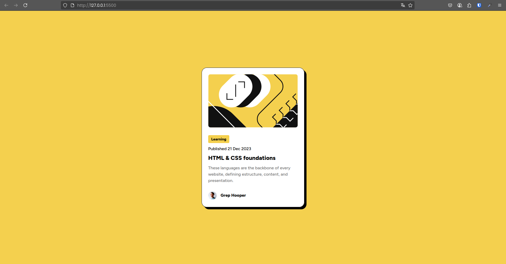
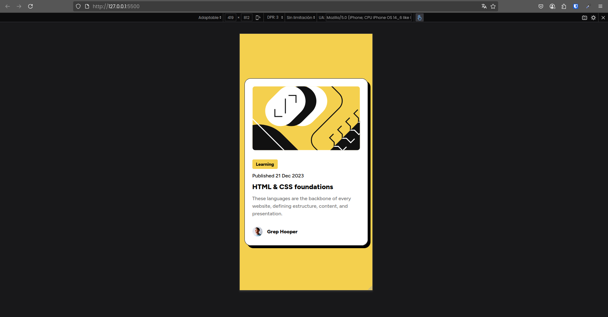

# 💡 Frontend Mentor - Blog Preview Card
This is a solution to the [Blog Preview Card in Frontend Mentor](https://www.frontendmentor.io/learning-paths/getting-started-on-frontend-mentor-XJhRWRREZd/steps/66e1acc75832c087f249d578/challenge/start). It's a simple project focused on practicing HTML and CSS fundamentals by creating a responsive card component that displays a preview of a blog post.

## 📌 Summary
In this project, I recreated a clean, responsive blog preview card component using semantic HTML and modern CSS techniques. It's a great exercise to reinforce my skills in layout, visual design, and responsive styling.

## 📸 Screenshot
### 🖥️ Desktop View

### 📱 Mobile View

### 🖱️ Hover animation

## 🌐 Live Preview
- 🔗 **Live Website**: [https://michaeljara905.github.io/Blog-Preview-Card-Personal/](https://michaeljara905.github.io/Blog-Preview-Card-Personal/)
- 💻 **Source Code**: [https://github.com/MichaelJara905/Blog-Preview-Card-Personal.git](https://github.com/MichaelJara905/Blog-Preview-Card-Personal.git)

## 🛠️ Tech Stack
- HTML5 Semantic Markup
- Custom CSS Properties
- Flexbox
- Google Fonts

## 🔄 My Workflow
### 🗂️ Project Setup
- I organized the folder structure with the different resources used and created the initial HTML/CSS files.

### 🧱 Design and Structure
- I developed the HTML layout using semantic tags for better accessibility.

### 🎨 Style
- I applied Flexbox to center the component vertically and horizontally.
- I used HSL color values ​​and custom CSS properties for consistent theming.

### 🚀 Deployment
- I deployed the finished project to GitHub Pages.

## 📚 What I Learned
- I improved my use of Flexbox for vertical and horizontal centering.
- I learned how to integrate and use Google Fonts effectively.
- I practiced using the :hover pseudo-class to apply interactive effects to the HTML & CSS foundations title.
- I focused on maintaining a clean, minimalist, and responsive design.
- I implemented responsive functionality for small screens.

        .foundations {
          display: flex;
          width: 100%;
          font-size: 11px;
          font-family: 'Figtree', sans-serif;
          transition: all 0.5s ease;
        }

        .foundations h1 {
          margin: 0;
        }

        .foundations:hover {
          color: #F4D04E;
        }

## 🔍 What I would do differently

If I revise or expand this project, I would do the following:

- Incorporate a visual category or tag system to better organize the blog content.
- Add a small animation when the card loads to make the experience more dynamic.
- Optimize the featured image to improve performance on mobile devices.
- Implement a more modular structure with reusable components, considering future integration with frameworks like React.

## 👤 Author
- Frontend Mentor - [@MichaelJara905](https://www.frontendmentor.io/profile/MichaelJara905)
- Instagram - [@jaramillo_maicol_0](https://www.instagram.com/jaramillo_maicol_0)
- GitHub - [@MichaelJara905](https://github.com/MichaelJara905)

## ✅ Conclusions. 
This project was an excellent opportunity to strengthen fundamental concepts and implement good web development practices. Every little detail counts, and continuing to build with intention and curiosity allows us to grow as developers one step at a time.